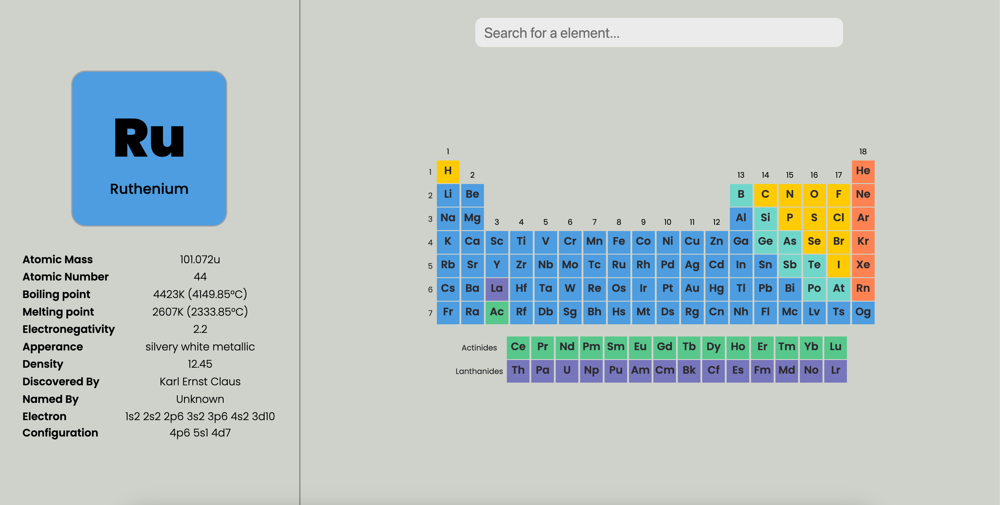
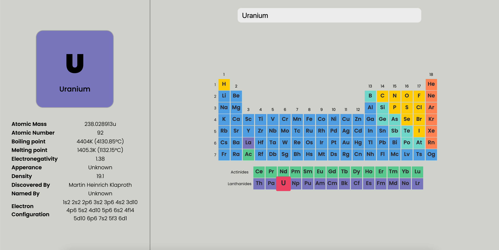

# Periodic Table
This is a simple app made in HTML, CSS and JavaScript
# Demo
Demo of this app is avaliable [here!]()
# Run it
To run this app you need to bascially put these commands into your terminal
```sh
git clone https://github.com/solindekdev/periodic-table && cd periodic-table
npm init
npm start
```
# Preview


